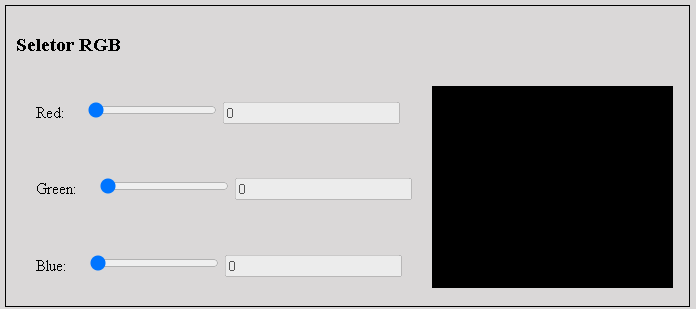

# 🌈 RGB Picker 🎯

---

<p align="center">
   
</p>

<div align="center">

[](https://github.com/gabiqrm/RGBPicker)<space> <space>[](https://github.com/gabiqrm/RGBPicker/blob/master/LICENSE)<space> <space>[](https://github.com/gabiqrm/RGBPicker/)

</div>
---

## 🔎 Acesso Rápido:


https://gabiqrm.github.io/RGBPicker/

---
## 📋 Sobre:

Este projeto originou-se a partir do Bootcamp do curso IGTI, foi um trabalho prático proposto pelo professor Rafael Gomide.

---
## ⚙️ Tecnologias Utilizadas:

O projeto foi desenvolvido utilizando as seguintes tecnologias:

🌲 HTML5

👾 CSS3

🕹️ JS


---
##  Execução:
```
1. Clonar via prompt de comando o projeto em uma pasta de sua preferência: `git clone https://github.com/RGBPicker`
2. Acessar a pasta principal do projeto via prompt de comando. Ex: `cd RGBPicker`;
3. Na pasta raiz, executar o arquivo: `index.html`
```
---

## 🔗 Contribuições:
```
- Faça o fork do projeto (https://github.com/RGBPicker)
- Crie uma branch para sua modificação (git checkout -b feature/[nome])
- Faça o commit (git commit -am 'Add files [nome]')
- Push (git push origin feature/[nome])
- Crie um novo Pull Request
```

---
## 🔐 Licença:
Esse projeto está sob a licença MIT. Veja o arquivo [LICENSE](LICENSE) para mais detalhes.

---
## 👩🏻‍💻 Desenvolvedora:

Desenvolvido por Gabriela Queiroz ! 💜
